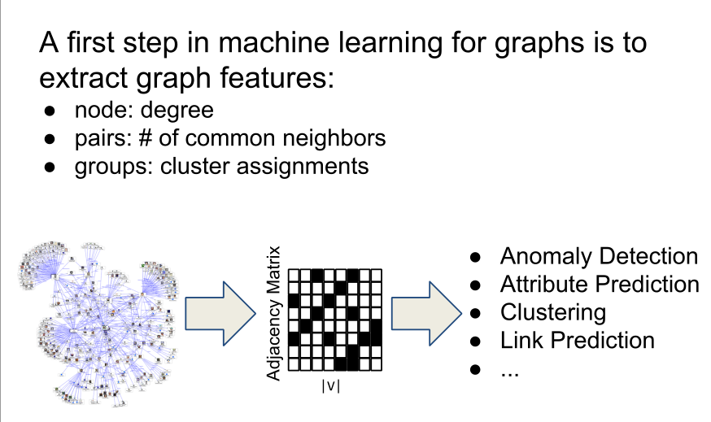
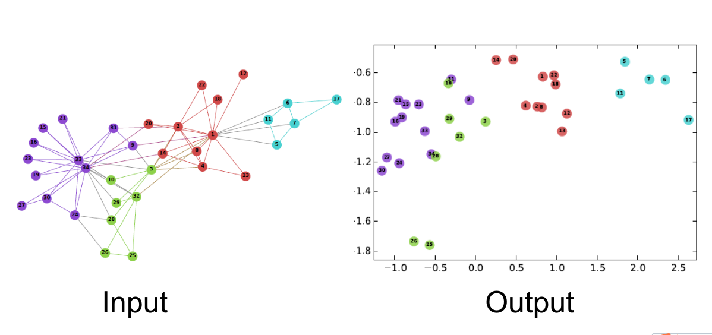
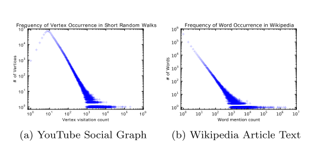
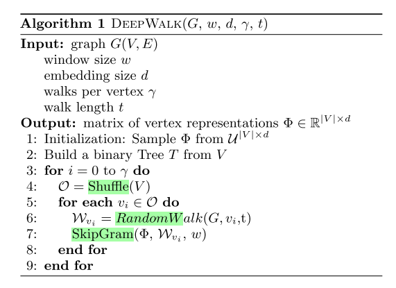
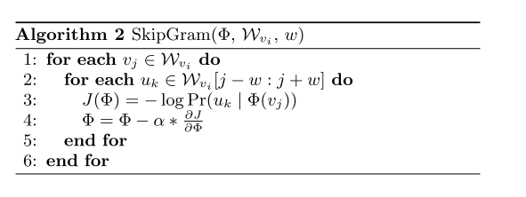
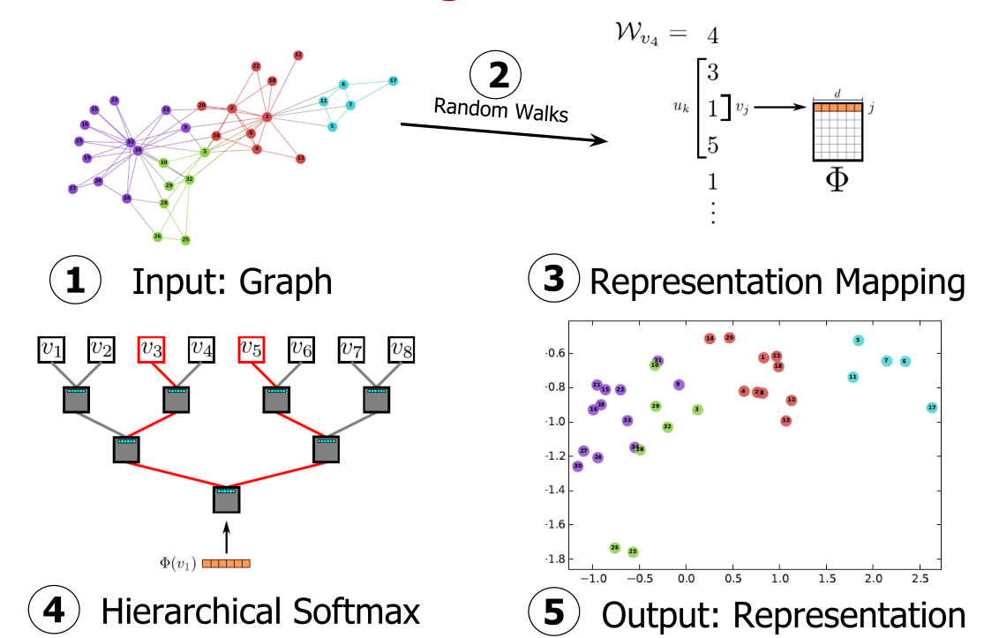
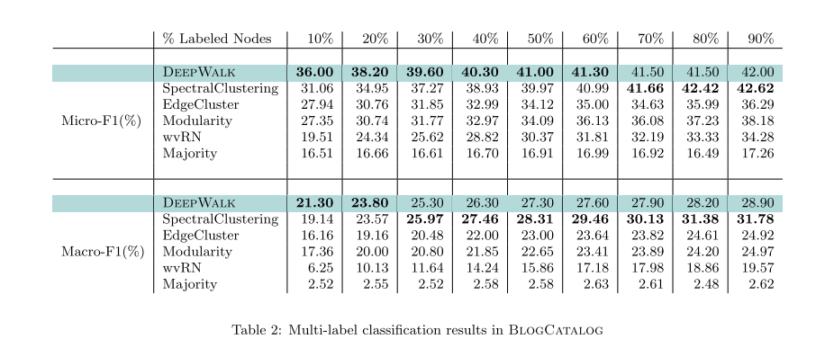
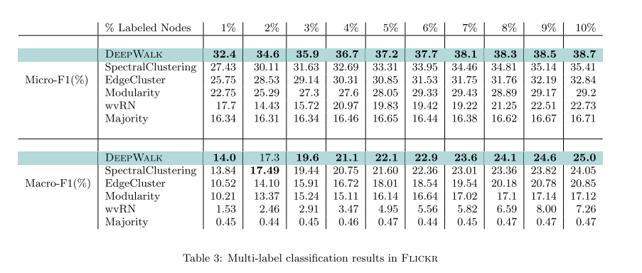
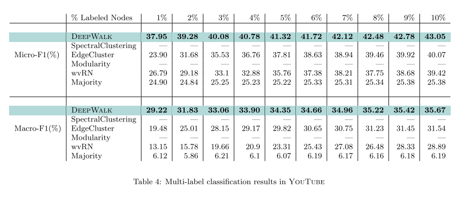
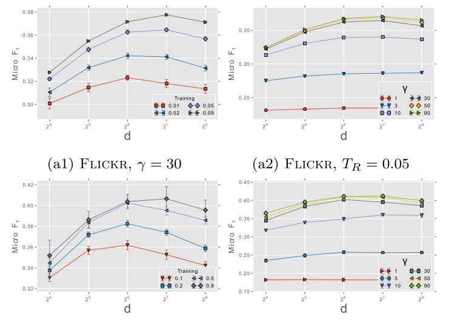

## 前言
> 好几个月没怎么看过论文了，最近算是了却了一些事情，知道必须重新开始看论文了，加之前段时间发现自己的博客还是有人看的，所以打算以后写论文笔记从OneNote转到本博客上，欢迎大家一起讨论交流。这篇文章是清华崔鹏大神组的，也是我读的第一篇关于角色embedding的文章，感觉这篇论文非常有意思。此外，写完论文之后再读别人的论文时，关注点发生了一些改变，现在更注重去读懂作者的动机，去分析作者的思路和作者的想法。

## 参考材料
- 原文链接：[https://www.kdd.org/kdd2018/accepted-papers/view/deep-recursive-network-embedding-with-regular-equivalence](https://www.kdd.org/kdd2018/accepted-papers/view/deep-recursive-network-embedding-with-regular-equivalence)
- 代码实现：[https://github.com/tadpole/DRNE](https://github.com/tadpole/DRNE)

## 引言
网络嵌入目的是在嵌入空间中保持节点的相似性，例如，如果两个节点具有结构相似性，则他们的表示也应该相似。通常使用的结构相似性是结构等价性(structural equivalence)，即如果两个节点有很多共同邻居，则认为其具有结构等价性。例如LINE、SDNE这些论文都是基于结构等价性的。  

然而在网络中有一些节点，他们并没有共同的邻居，但他们具有相同的“角色”或者处于相同的“位置”，例如两位母亲都有一个共同的模式，就是连接着一位丈夫和若干个孩子。虽然这两位母亲可能没有连边，但她们有共同的角色母亲，这就是本文提到的规则等价性（regularly equivalent）。实际上规则等价性是结构等价性的一种松弛，容易得出如果两个节点具有结构等价性，则一定具有规则等价性，反之不成立。因此规则等价性更灵活。  

为了保持规则等价性，最直接的方法对于每个节点对，计算其规则等价性并约束节点表示的相似性。但是对于large-scale来说这么做不现实。一种替代的方法是使用一些中心性测量方法来代替，但是一种中心性仅仅可以保持一种具体角色(?)，而且一些中心性方法本身复杂度很高。

如图一所示，规则等价性的定义是递归的，换句话说，两个具有规则等价性的节点其邻居也是规则等价的。利用这种特性，本文利用LSTM来刻画这种递归的关系。 

总结本文的动机如下：
- regular equivalence is more flexible and capable of covering a broad range of network applications related to structural roles or node importance, but is largely ignored by the literature of network embedding
- How to effectively and efficiently preserve regular equivalence in network embedding is still an open problem
- the definition of regular equivalence is recursive. This enlightens us to learn network embedding in a recursive way

贡献主要有以下三点：
- 本文研究了一个新颖的问题，就是通过规则等价性来学习节点的表示
- 通过提出的DRNE模型可以很好的刻画规则等价性
- 实验结果证实模型的优越性

## DEEP RECURSIVE NETWORK EMBEDDING
### 结构等价性和规则等价性的定义

### 损失函数
由于规则的定义本身就是递归的，所以我们同样需要使用一种递归的定义方式来刻画规则的等价性。因此，通过使节点的表示逼近它的邻域节点结构，同时通过迭代就可以收集到全局的信息。因此定义以下损失函数：

其中Agg是整合函数，用来整合节点$v$的邻域的信息。这里作者采用了LSTM来作为整合函数，

## 背景知识  
这篇论文涉及到word2vec相关的知识，所以需要先了解一下神经语言模型相关的内容。详细的内容可以见博客：[http://shomy.top/2017/07/28/word2vec-all/](http://shomy.top/2017/07/28/word2vec-all/)，这篇博客是一位学长写的，很不错。  
原文链接：  [http://www.perozzi.net/publications/14_kdd_deepwalk.pdf](http://www.perozzi.net/publications/14_kdd_deepwalk.pdf)  
github代码链接：[https://github.com/phanein/deepwalk](https://github.com/phanein/deepwalk)  
作者的slide：[http://www.perozzi.net/publications/14_kdd_deepwalk-slides.pdf](http://www.perozzi.net/publications/14_kdd_deepwalk-slides.pdf)  

## Motivation
这篇文章的算法很简单，但是这篇文章提出了一种新的处理方法或者说是分支：把复杂网络中的节点表示成为潜在的向量（所谓潜在的向量就是无法直接观测得到的向量，具体的解释见[https://en.wikipedia.org/wiki/Latent_variable](https://en.wikipedia.org/wiki/Latent_variable),这种欧式空间的向量可以非常方便的用于机器学习的算法。通俗的讲我认为本文提出deepwalk的动机如下：  
  1. 常规使用邻接矩阵只能表示网络的一种节点和边的信息，无法很好的刻画网络中节点或边的一些特征，而转化为连续向量空间后却可以刻画这种特征  
  2. 邻接矩阵是很稀疏的（O(n^2)级别的差距可以认为是稀疏的），维度很高。所以使用邻接矩阵和矩阵分解那一套很难实现Large-scale，而通过所谓的network embedding 可以把网络压缩成一个低维的稠密的向量，因此可以实现Large-scale，具体见下图。  
  3. 想要使用机器学习的算法，直接用邻接矩阵自然是不可行的，所以不得不寻找一种方法来得到一种潜在的表示。这一点原文说的特别优雅：“Machine learning applications in net  ，works (such as network classification [16, 37], content rec- ommendation [12], anomaly detection [6], and missing link prediction [23]) must be able to deal with this sparsity in order to survive.”  

  

所以本文：提出了一种从语言模型中发展过来的方法来学习邻接矩阵的潜在表示。  
可视化样例：  

  

## PROBLEM DEFINITION
输入：G = (V,E),其中V为点集，E为边集。
输出：对于\\(G_L=(V,E,X,Y)\\)（其中X是特征，Y标签集合），一般的机器学习问题，需要学习一个从X映射到Y的hypothesis。而本文的任务就是学习得到X的表示。  
## method
### 语言模型与图数据的联系
a)表示复杂网络（rfree-scale）的度分布，  
b)表示wiki中单词的分布。

  

由上图可知两者都服从幂律分布，所以作者提出一个cool idea：随机游走产生的序列等价于语言中的句子。虽然这种联系很牵强，因为在自然语言中句子是有顺序和语义存在的，而随机游走彻底消除了这种顺序的关系。  

### deepwalk
deepwalk算法分为两个部分：randomwalk生成器和word2vec的skipgram模型。
* 这里使用的随机游走就是最简单的模型，设
\\(w_{v_i}\\)表示根节点为点\\({v_i}\\)的一条随机游走，每一步从它的邻居中随机选择一个直到达到了最大长度t（可能会restart）。这样就产生很多条随机游走序列来表示语料库。

  

* 得到随机游走序列后当做句子直接丢给word2vec训练就可以了，本文使用的模型是skipgram+Hierarchical Softmax，论文中的公式就不在此列举了，因为和word2vec的一毛一样，如果word2vec懂得话就非常简单了。  

 

算法的整体流程如下图所示：

 

### 优化
从随机游走生成器生成序列之后，就都是word2vec那一套了，word2vec可以实现online，可以使用ASGD，同样也很容易理解可以实现并行执行。  
## 实验
实验部分这篇论文也非常简单，主要做了两部分：多标签分类和参数敏感性分析。  
### 数据集
> An overview of the graphs we consider in our experiments
is given in Figure 1.  
* **BlogCatalog** [39] is a network of social relationships provided by blogger authors. The labels represent the topic categories provided by the authors.
* **Flickr** [39] is a network of the contacts between users of the photo sharing website. The labels represent the
interest groups of the users such as ‘black and white photos’.  
* **YouTube** [40] is a social network between users of the popular video sharing website. The labels here
represent groups of viewers that enjoy common video genres  

## 多标签分类
   

   

   

## 参数敏感性分析
### Effect of Dimensionality：
    

从这组参数敏感性分析可以发现latent represent的维数d=128时效果最好，维数过小时欠拟合，维数过高时会过拟合（对节点表示有影响的就那么几维，维度过高会引入很多无关的表达，反而会影响到分类的效果）  
### Effect of sampling frequency
    

## 总结
这篇文章中提到了很多deepwalk的优势，但实际上都是照搬word2vec的，比如说online Learning、并行化、ASGD等等。

## 后记
综上所述，从这篇论文中，我学到了两个非常重要的内容：一个是network embedding的思想，可以说是这篇文章开创性的工作。二是所谓的写作的技巧，虽然算法和思想很朴素，但是作者对问题的理解很深刻，所以论文写出来就显得非常优美、高大上，涉及到很多其他方面的知识。完美的把简单的算法包装起来，真的服气。  
本来打算这几天把DeepWalk实现一下，但是受到清华大学涂存超他们写的[OpenNE](https://github.com/thunlp/OpenNE的启发),决定看完Node2vec，然后直接写Node2vec，最后用Node2vec就可以很容易实现Deepwalk了。  

## 遗留的问题
* efficient discrete algorithms?  
* cascading errors, which can occur in iterative methods ?    
* 输入输出敏感  
* shuffle的作用，加快收敛？  

